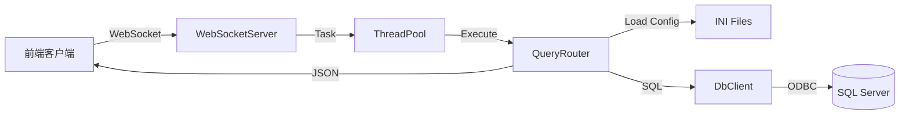

# 海丰 SQL Server WebSocket 服务端 - 开发文档

本文档详细说明了本项目的后台架构、核心模块设计以及与前端图表对接的数据格式规范。

## 1. 项目概述

本项目是一个基于 C++ (Win32 API) 开发的轻量级 WebSocket 服务端，主要用于连接 SQL Server 数据库，执行预定义的 SQL 查询，并将结果以 JSON 格式实时返回给前端客户端。项目设计为 Windows 服务运行，支持多线程并发处理。

## 2. 核心架构

系统采用 **分层架构** 与 **单例模式** 相结合的设计，主要包含以下几个核心层级：

### 2.1 数据流向图



### 2.2 核心模块

1.  **WebSocketServer (网络接入层)**
    *   **职责**：监听端口 (默认 8196)，处理 TCP 连接，完成 WebSocket 握手 (SHA1 + Base64)，解析 WebSocket 数据帧。
    *   **机制**：使用原生 WinSock API，非阻塞模式或多线程接收。

2.  **ThreadPool (并发处理层)**
    *   **职责**：维护一个工作线程池，将网络层接收到的请求（Task）放入队列异步执行。
    *   **机制**：生产者-消费者模型，互斥锁 (Mutex) + 条件变量 (Condition Variable) 同步。

3.  **QueryRouter (业务逻辑层)**
    *   **职责**：解析客户端 JSON 请求，根据 `query_id` 匹配 `.ini` 配置文件中的 SQL 逻辑，并将数据库结果转换为指定格式的 JSON。
    *   **配置**：支持热加载或启动加载 `queries/*.ini`。

4.  **DbClient (数据持久层)**
    *   **职责**：封装 ODBC API，管理数据库连接。
    *   **特性**：支持驱动自动回退 (ODBC Driver 18 -> 17 -> SQL Server)，支持临时连接创建。

## 3. 图表数据格式 (JSON Return Format)

为了支持前端各类图表组件（如 ECharts、Highcharts 等）直接渲染数据，`QueryRouter` 支持通过配置文件中的 `return_format` 字段指定四种标准 JSON 返回格式。

### 配置方式
在 `.ini` 文件的查询节点中添加：
```ini
return_format=格式类型
```
可选值：`list` (默认), `object`, `chart_columns`, `chart_matrix`

---

### 3.1 `list` (默认列表格式)
*   **适用场景**：普通表格展示，数据明细。
*   **结构**：对象数组，每个对象代表一行数据。
*   **JSON 示例**：
    ```json
    [
        {"工单号": "WO2023001", "数量": 100},
        {"工单号": "WO2023002", "数量": 50}
    ]
    ```

### 3.2 `object` (单对象格式)
*   **适用场景**：仪表盘数字、汇总统计卡片（只取第一行数据）。
*   **结构**：单个 JSON 对象。
*   **JSON 示例**：
    ```json
    {
        "total_inventory": 52300,
        "last_update": "2023-10-01"
    }
    ```

### 3.3 `chart_columns` (列式图表格式)
*   **适用场景**：多维度对比图、折线图、柱状图。前端通常需要将每一列的数据单独作为一个数组。
*   **结构**：Key 为列名，Value 为该列所有数据的数组。
*   **JSON 示例**：
    ```json
    {
        "x": ["12/01", "12/02", "12/03"],
        "produce": [150, 200, 180],
        "rate": [98.5, 99.0, 97.5]
    }
    ```
*   **配置示例** (`queries/overview.ini`):
    ```ini
    [overview.order_status]
    return_format=chart_columns
    columns=complete:decimal,order:decimal,rate:decimal,x:varchar
    ```

### 3.4 `chart_matrix` (矩阵图表格式)
*   **适用场景**：堆叠图、复杂分组图表。通常第一列为 X 轴，其余列作为数据序列。
*   **结构**：包含 `x` 轴数组和 `values` 二维数组。
*   **逻辑**：
    *   SQL 查询的第一列自动映射为 `x` 轴数据（或使用配置列名）。
    *   SQL 查询的后续列数据，按行组合成数组，放入 `values` 中。
*   **JSON 示例**：
    ```json
    {
        "x": ["周一", "周二", "周三"],
        "values": [
            [120, 132, 101],  // 对应第二列数据
            [220, 182, 191]   // 对应第三列数据
        ]
    }
    ```
    *(注：具体实现中，`values` 数组的组织方式取决于具体实现逻辑，当前逻辑是将后续列分别作为一个数组放入 values 中，即 `values[0]` 是第二列的所有数据，`values[1]` 是第三列的所有数据)*
    
    **修正说明**：当前代码逻辑 (`QueryRouter.cpp`) 对于 `chart_matrix` 的实现如下：
    ```json
    {
        "x": ["周一", "周二", "周三"], // 第一列
        "values": [
            [120, 132, 101], // 第二列全量数据
            [220, 182, 191]  // 第三列全量数据
        ]
    }
    ```
    这方便前端直接通过 `series[i].data = data.values[i]` 进行赋值。

## 4. 开发指南

### 4.1 添加新查询
1.  在 `queries` 目录下找到对应的 `.ini` 文件（或新建）。
2.  添加 Section，例如 `[module.query_name]`。
3.  配置 `sql` 语句。
4.  配置 `columns` 定义列名和类型。
5.  配置 `return_format` 适配前端图表。

### 4.2 编译环境
*   Visual Studio 2019/2022
*   C++17 Standard
*   依赖库：WinSock2, ODBC32 (系统自带)

### 4.3 调试
*   日志输出至标准控制台 (Console)。
*   可以使用 WebSocket 测试工具连接 `ws://localhost:8196` 发送 `{"query": "module.query_name"}` 进行测试。
